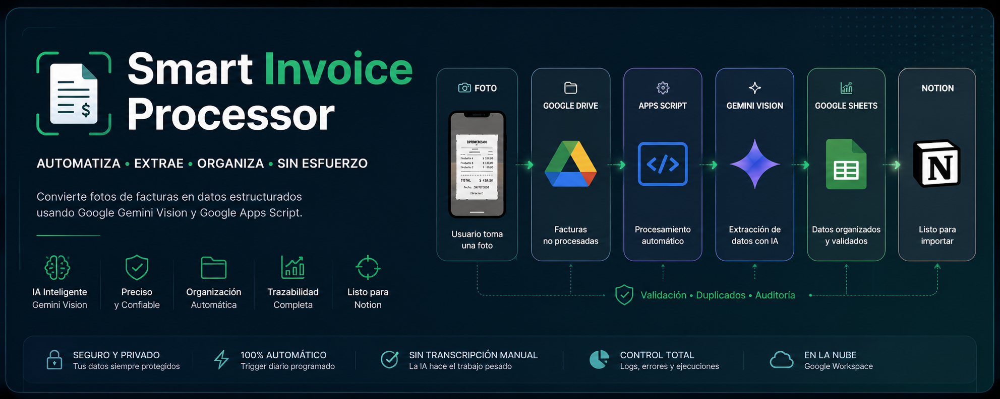
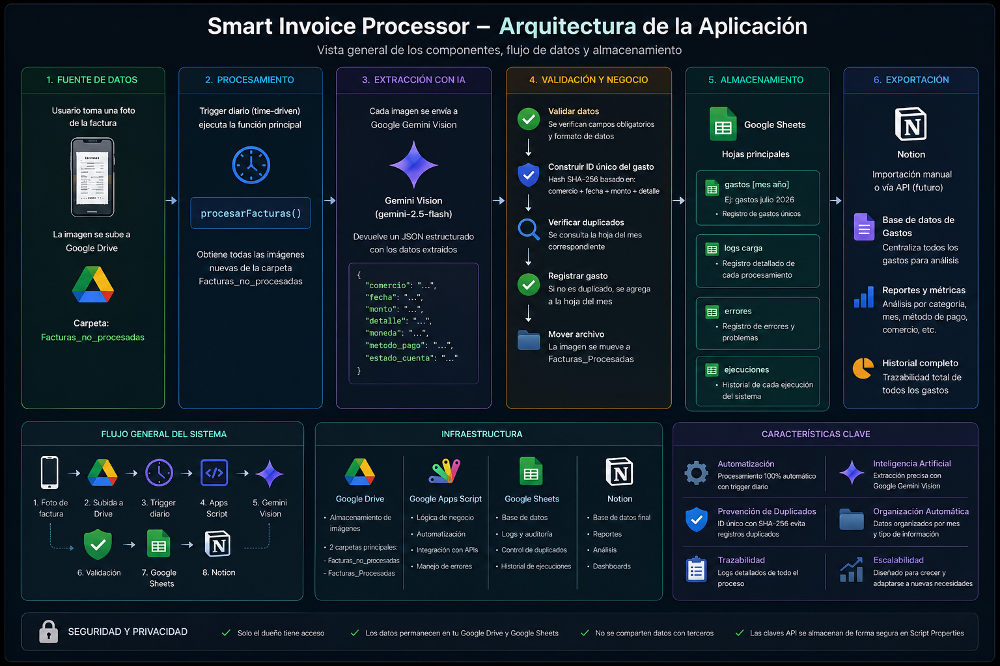

# Smart Invoice Processor (SIP)

<p align="center">
  
</p>

Automatiza el procesamiento de facturas utilizando **Google Apps Script** y **Google Gemini Vision**.

A partir de una fotografía tomada desde un teléfono móvil, la aplicación extrae automáticamente la información relevante de la factura, la organiza en Google Sheets y la deja lista para ser importada a Notion.

---

## Características

- 📷 Procesamiento de imágenes (JPG, PNG, HEIC)
- 🤖 Extracción de datos mediante Google Gemini Vision
- 📊 Organización automática por mes
- 🚫 Detección de facturas duplicadas
- 📝 Auditoría y trazabilidad del procesamiento
- ⚠ Validación de datos incompletos
- 📦 Exportación compatible con Notion
- ⏰ Ejecución automática mediante Triggers de Google Apps Script

---

## Arquitectura

La siguiente imagen resume el flujo completo de la aplicación.

<p align="center">
  
</p>

---

## Flujo de procesamiento

```text
Usuario
   │
   ▼
Fotografía de la factura
   │
   ▼
Google Drive
(Facturas_no_procesadas)
   │
   ▼
Google Apps Script
(procesarFacturas)
   │
   ▼
Google Gemini Vision
   │
   ▼
Validación
   │
   ▼
Google Sheets

├── gastos <mes año>
├── logs carga
├── errores
└── ejecuciones

   │
   ▼
Exportación CSV
   │
   ▼
Notion
```

---

## Tecnologías utilizadas

| Tecnología | Uso |
|------------|-----|
| Google Apps Script | Automatización |
| Google Drive | Almacenamiento de imágenes |
| Google Sheets | Persistencia de datos |
| Google Gemini Vision | Extracción de información |
| Google AI Studio | Gestión de API Key |
| Notion | Administración de gastos |

---

## Estructura del proyecto

```text
SmartInvoiceProcessor/

├── Code.gs
├── docs/
│   ├── Manual_de_Usuario.md
│   ├── Documentacion_Tecnica.md
│   └── assets/
│       └── sip.png
│
├── Facturas_no_procesadas/
└── Facturas_Procesadas/
```

---

## Documentación

La documentación completa se encuentra en la carpeta **docs**.

- 📘 Manual de Usuario
- ⚙️ Documentación Técnica

---

## Requisitos

- Cuenta de Google
- Google Apps Script
- Google Drive
- Google Sheets
- API Key de Google Gemini

---

## Seguridad

Este repositorio **no contiene claves API** ni información sensible.

La clave de Gemini debe configurarse mediante **Script Properties**:

```
GEMINI_API_KEY=<tu_api_key>
```

---

## Estado del proyecto

🚧 En desarrollo activo.

Actualmente soporta:

- ✔ Procesamiento automático de facturas
- ✔ Organización mensual
- ✔ Detección de duplicados
- ✔ Registro de auditoría
- ✔ Exportación compatible con Notion

---

## Licencia

Proyecto desarrollado con fines educativos, personales y de automatización de procesos.
